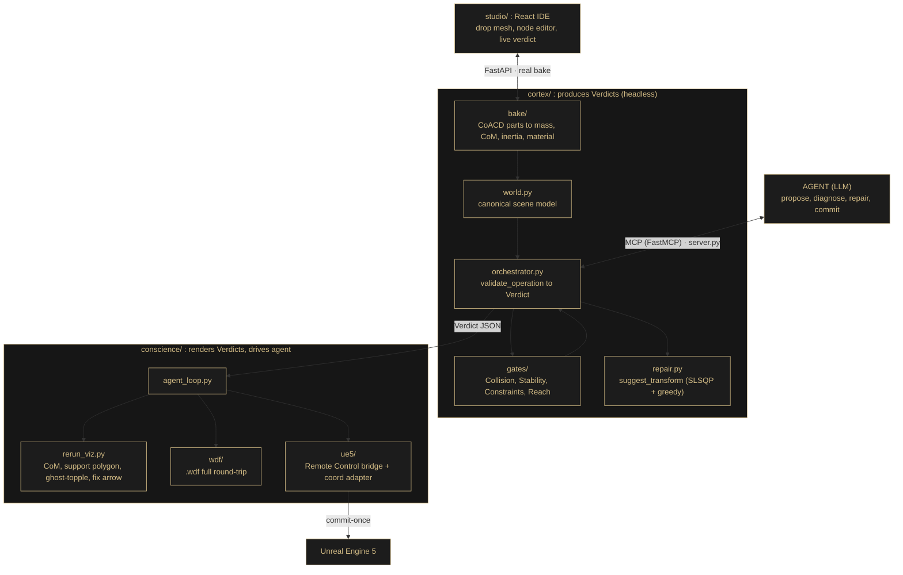

<div align="center">

# PLUMB

**A spatial cortex and a language for physically-grounded, intent-aware 3D worlds.**

*glTF and USD describe geometry. PLUMB describes meaning, physics, and intent.*

[](https://www.python.org/downloads/release/python-3120/)
[-7c3aed.svg)](https://modelcontextprotocol.io/)
[](#roadmap)

</div>

---

LLM agents driving 3D worlds are **spatially blind**. They emit transforms from text
priors and discover failure only after the fact (objects in walls, floating assets,
unstable stacks, blocked doors). PLUMB sits between any agent and a 3D engine and
**validates every proposed change before it commits**, returning not just *no* but the
exact number it failed by and the direction to fix it:

> **Stability −7 cm · shift +6 cm toward centre.**

Because every gate is a cost function, the maths that *rejects* a placement is the maths
that *repairs* it. Full vision: [`PLUMB_master_spec.md`](PLUMB_master_spec.md).

---

## Table of contents

- [The bet](#the-bet)
- [The seam](#the-seam)
- [Architecture](#architecture)
- [Cortex](#cortex)
- [Conscience](#conscience)
- [Studio](#studio)
- [Setup](#setup)
- [Layout](#layout)
- [Roadmap](#roadmap)
- [Constraints](#constraints)

---

## The bet

**Topple-and-repair** is the one beat the project rides on. A top-heavy bronze figure is
placed too close to a pedestal edge. The **Stability gate** flashes red `−7 cm`, its
centre of mass pops outside the support polygon, the figure ghost-topples, an arrow says
*"+6 cm toward centre."* `suggest_transform` nudges it, we re-run, **all green**, and it
snaps upright.

Everything else (UE5 bridge, node editor, `.wdf` language, Asset Studio, bake archetypes)
is a **bonus ring** layered on the same Verdict JSON. The flagship is rendered entirely in
**Rerun**, with no live UE5 required.

## The seam

Everyone meets at **one frozen contract**: [`contracts.py`](contracts.py), the `Diff`,
`Verdict`, and `PAP` schemas plus the MCP tool signatures. Until the real cortex exists,
the conscience builds against [`fixtures.py`](fixtures.py) (fake verdicts). Same JSON
shape either way, so neither half ever blocks the other.

```
        Diff ──▶  [ CORTEX ]  ──▶  Verdict  ──▶  [ CONSCIENCE ]
                 produces truth                 renders truth + drives the agent
                       │                                   │
                       └────────────  contracts.py  ───────┘   (the only shared surface)
```

Full decision record and per-file ownership: [`DECISIONS.md`](DECISIONS.md).

## Architecture

One loop, **Bake → Author → Propose → Gate → Repair → Commit**, across three packages
that meet only at `contracts.py`. Canonical space throughout: **Z-up, right-handed,
metres, kilograms.**



**The one idea that unifies it:** every gate's check is *also* a cost function. "Pass"
means `cost ≤ tolerance`; the violation magnitude *is* the cost; its gradient *is* the
fix arrow. So validation and repair are the same maths.

## Cortex

`cortex/` produces Verdicts. Headless, deterministic, unit-testable. Composition-aware
bake (CoACD parts to density-weighted mass/CoM/inertia), then world model, then gates
(Stability = quasi-static CoM-over-polygon margin, Collision = convex-part clearance,
Reach = 2D floor projection, Constraints = hardcoded cost functions), then
`suggest_transform` repair, then type-aware bake profiles (door/tree/shelf), exposed as a
FastMCP tool surface.

> **Done when** `validate_operation(topple_diff)` returns a stability-fail Verdict and
> `suggest_transform` flips it green.

## Conscience

`conscience/` renders Verdicts and drives the agent: the agent loop (scripted, then real
LLM, with a recorded fallback), the `.wdf` **full round-trip** serializer/parser, the
**UE5 Remote Control bridge** plus a negate-X coordinate adapter with golden round-trip
tests, the material-confirm panel, and Rerun viz (ghost-topple, CoM marker, support
polygon, fix arrow).

> **Done when** feeding `VERDICT_TOPPLE` then `VERDICT_REPAIRED` shows red→green, `.wdf`
> round-trips, and UE5 commit-once lands (or falls back to Rerun).

## Studio

`studio/` is the bake and constraint IDE: React, TypeScript, Vite, Three.js. Drop a mesh,
a FastAPI backend runs the real bake, and a node editor lights up green / amber / red
straight from the live verdict. Gemini powers the semantic material bake.

## Setup

> **Python 3.12** (not 3.13 / 3.14, since the physics wheels like CoACD and manifold3d lag
> behind newer interpreters).

```bash
python3.12 -m venv .venv
. .venv/Scripts/activate          # PowerShell: .venv\Scripts\Activate.ps1
pip install -e ".[dev]"
pytest                            # incl. the golden coordinate round-trip
```

Run the FastMCP cortex (so an agent can call the validation tools):

```bash
python -m cortex.server
```

Run the studio (separate terminal):

```bash
cd studio && npm install && npm run dev
```

## Layout

```
contracts.py          # FROZEN. Diff / Verdict / PAP / MCP tool signatures. The seam.
fixtures.py           # Fake verdicts + PAPs so the conscience starts unblocked.
cortex/               # Produces Verdicts (headless physics + gates + repair + MCP).
conscience/           # Renders Verdicts, drives the agent, .wdf language, UE5 bridge.
studio/               # React/TS bake & constraint IDE (FastAPI backend + node editor).
tests/                # Unit tests incl. golden coordinate round-trips.
PLUMB_master_spec.md  # The full vision (reference, not the weekend scope).
DECISIONS.md          # Resolved design decisions + per-file ownership.
```

## Roadmap

- [ ] More powerfull node editor: mask selection, influence on the 3d scene
- [ ] Working implementation of validation/repair
- [ ] More bake archetypes: seasonal trees, auto-filling shelves.
- [ ] Terrain-aware placement on uneven ground.
- [ ] Engines beyond Unreal: Unity, Blender, Omniverse (the world model and `.wdf` are
      engine-agnostic; only the thin adapter changes).
- [ ] `.wdf` vocabulary packs: import reusable asset and profile libraries like code.

## Constraints

A few rules are load-bearing and non-negotiable:

- **`contracts.py` is frozen.** Both sides must agree before any schema change.
- **Structural bake outputs** (stiffness, max-load) are **labelled experimental priors**,
  never hard-gated; single-mesh mass inference is weak science, so a human can always override.
- **UE5 is commit-once**, never live two-way; if a round-trip exceeds ~1–2 s or any golden
  coordinate test fails, fall back to Rerun-only.
- **Coordinate conversions** (handedness, winding, cm to m) live behind one adapter proven
  by golden round-trip tests.

---

<div align="center">
<sub>A plumb line is the oldest tool for testing whether something hangs <em>true</em> under
gravity. Nothing commits to the world until it has been proven physically and intentionally true.</sub>
</div>
